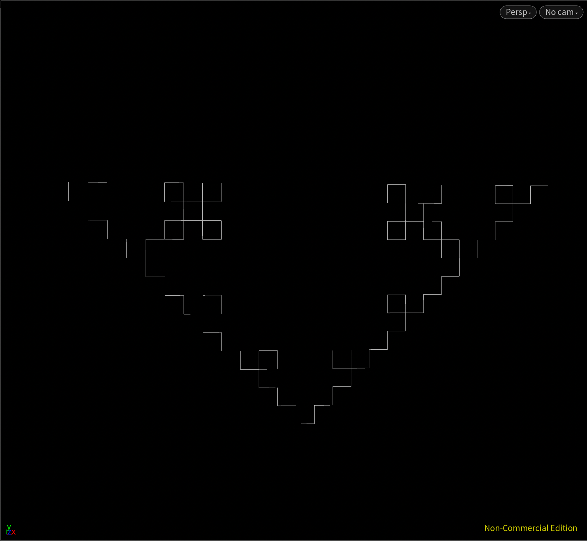
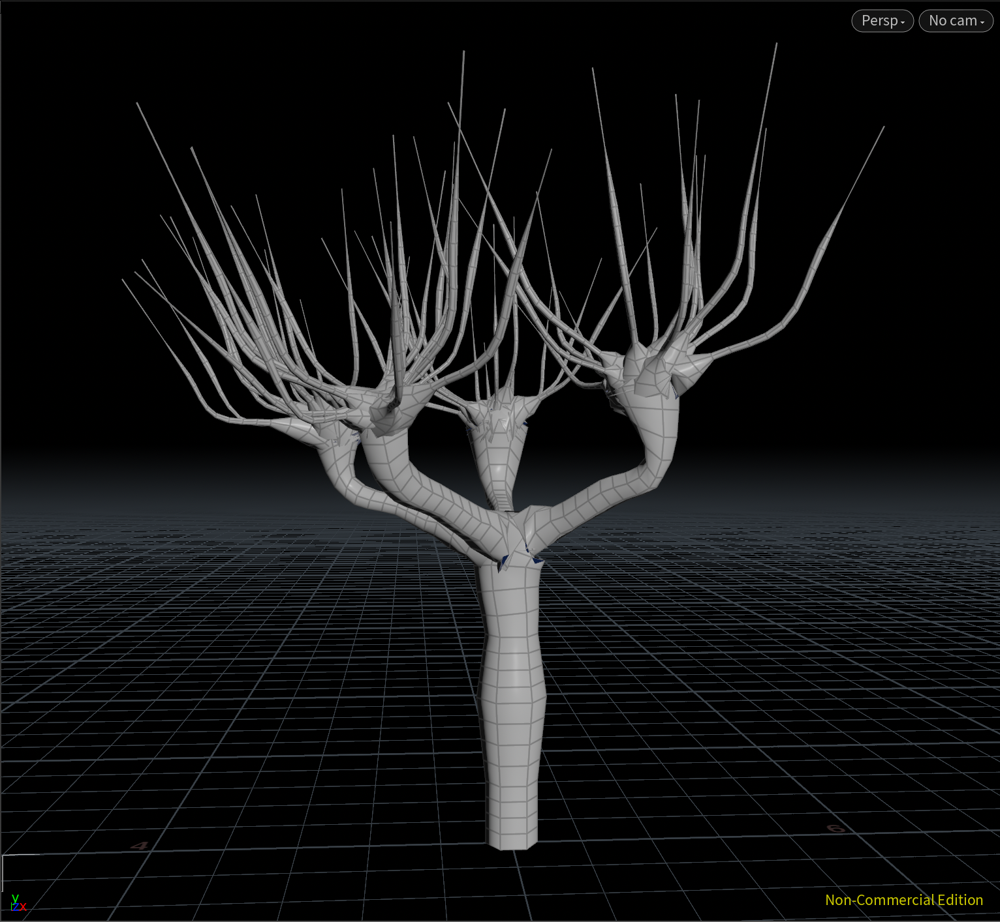
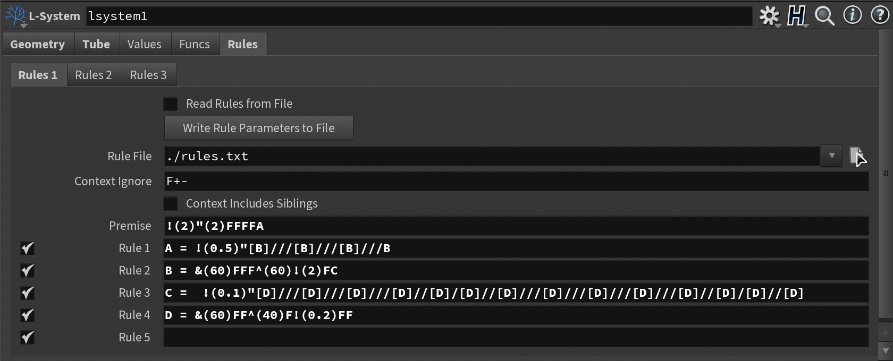
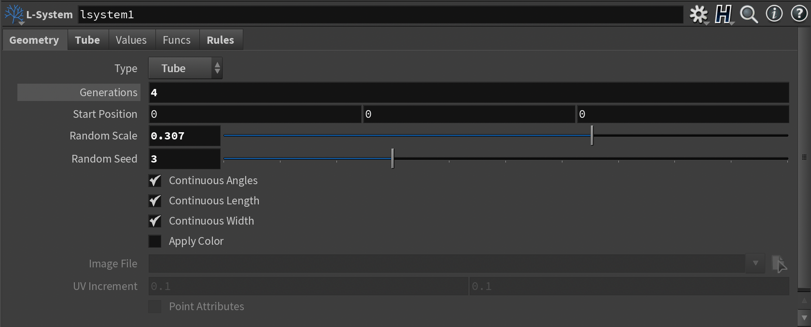
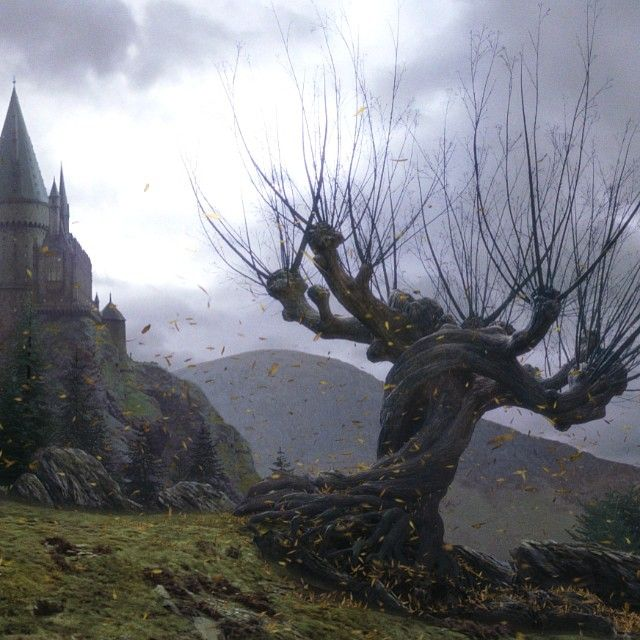

# lab04-lsystems
Let's practice using grammars! For this lab, please pull up the L-system node in Houdini.

# Demo
**First puzzle**

**Second puzzle**

**Custom plant**

 
For the custom plant, I tried to create a whomping willow. I tired to add some randomness to the trunk but it definitely need more randomness. If I had more time I think I can use the &(angle) and +/-(angle) to create two twisting trunk as the reference picture shows. 

## 1. Wheat grammar puzzle
Look at these iterations (n = 1, 2, 3) of a one-rule grammar. Using the built in symbols in Houdini, design a grammar that produces this output.\

## 2. Square grammar puzzle
How about this one?\

## 3. Custom plant
Choose a plant in the world. Working off a reference, design a grammar that mimics the structure of that plant. Unlike our simple puzzles, please use multiple rules for greater complexity. You can take this as an opportunity to design a grammar for your homework assignment! Include images of your grammar's output.

## Submission
- Create a pull request against this repository
- In your readme, list your solutions to the puzzles, then your custom grammar and images of a few iterations of output
- Profit
